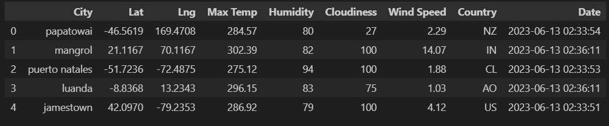

# python-api-challenge

# Weather_Analysis

## Main Objective
1-Perform tasks using new Python libraries and modules.
2-Pandas, gmaps, requests, numpy, random, matplotlib, timeit, scipy, citipy, datetime, time
3-Retrieve and use data from an API "get" request to a server.
4-Retrieve and store values from a JSON array.
5-Use try and except blocks to resolve errors.
6-Write Python functions.
7-Create scatter plots using the Matplotlib library, and apply styles and features to a plot.
8-Perform linear regression, and add regression lines to scatter plots.
9-Create heatmaps, and add markers using the Google Maps API.

# Overview
This challenge includes two parts:

## Part 1 - WeatherPy
Create a Python script to visualize the weather of 500+ cities across the world of varying distance from the equator. To accomplish this, you’ll be utilizing a simple Python library, Citipy, and the OpenWeatherMap API.

The first requirement is to create a series of scatter plots to showcase the relationships between location and temperature, humidity, wind speed, and cloudiness.

The second requirement is to run linear regression on each relationship for the northern and southern hemispheres.

Steps to follow:
Randomly select at least 500 unique (non-repeat) cities based on latitude and longitude.
Perform a weather check on each of the cities using a series of successive API calls.
Include a print log of each city as it’s being processed with the city number and city name.
Save a CSV of all retrieved data and a PNG image for each scatter plot.

## Part 2 - VacationPy
Work with weather data created in Part I to plan future vacations. Use jupyter-gmaps and the Google Places API for this part of the assignment.
Narrow down the dataframe to find your ideal weather condition. For example:
A max temperature lower than 80 degrees but higher than 70.
Wind speed less than 10 mph.
Zero cloudiness.
Drop any rows that don’t contain all three conditions. You want to be sure the weather is ideal.
Using Google Places API to find the first hotel for each city located within 5000 meters of your coordinates.
Plot the hotels on top of the humidity heatmap with each pin containing the Hotel Name, City, and Country.

# Process
Retrieve the Weather Data

An API was established with OpenWeatherMap and a DataFrame was created to get the initial list of potential cities.

# Statistical Analysis
Global city data was plotted, and linear regression was used to find the relationship between the following variables:

Latitude and Maximum Temperature
Latitude and Humidity
Latitude and Cloudiness
Latitude and Wind Speed

